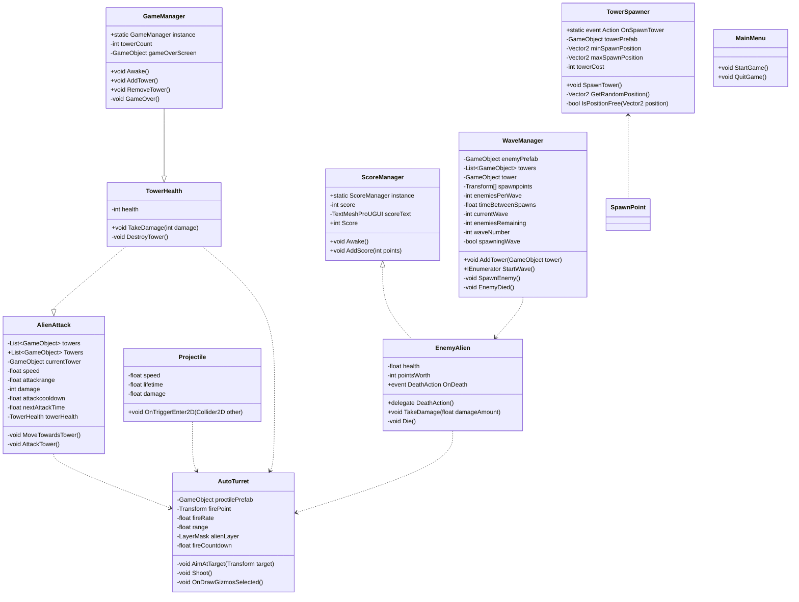

```mermaid
classDiagram

    class GameManager {
        +static GameManager instance
        -int towerCount
        -GameObject gameOverScreen
        +void Awake()
        +void AddTower()
        +void RemoveTower()
        -void GameOver()
    }

        class TowerSpawner {
        +static event Action<GameObject> OnSpawnTower
        -GameObject towerPrefab
        -Vector2 minSpawnPosition
        -Vector2 maxSpawnPosition
        -int towerCost
        +void SpawnTower()
        -Vector2 GetRandomPosition()
        -bool IsPositionFree(Vector2 position)
    }

        class TowerHealth {
        -int health
        +void TakeDamage(int damage)
        -void DestroyTower()
    }

        class ScoreManager {
        +static ScoreManager instance
        -int score
        -TextMeshProUGUI scoreText
        +int Score
        +void Awake()
        +void AddScore(int points)
    }

    class EnemyAlien {
        -float health
        -int pointsWorth
        +delegate DeathAction()
        +event DeathAction OnDeath
        +void TakeDamage(float damageAmount)
        -void Die()
    }

        class WaveManager {
        -GameObject enemyPrefab
        -List~GameObject~ towers
        -GameObject tower
        -Transform[] spawnpoints
        -int enemiesPerWave
        -float timeBetweenSpawns
        -int currentWave
        -int enemiesRemaining
        -int waveNumber
        -bool spawningWave
        +void AddTower(GameObject tower)
        +IEnumerator StartWave()
        -void SpawnEnemy()
        -void EnemyDied()
    }

        class AlienAttack {
        -List~GameObject~ towers
        +List~GameObject~ Towers
        -GameObject currentTower
        -float speed
        -float attackrange
        -int damage
        -float attackcooldown
        -float nextAttackTime
        -TowerHealth towerHealth
        -void MoveTowardsTower()
        -void AttackTower()
    }

        class AutoTurret {
        -GameObject proctilePrefab
        -Transform firePoint
        -float fireRate
        -float range
        -LayerMask alienLayer
        -float fireCountdown
        -void AimAtTarget(Transform target)
        -void Shoot()
        -void OnDrawGizmosSelected()
    }

        class Projectile {
        -float speed
        -float lifetime
        -float damage
        +void OnTriggerEnter2D(Collider2D other)
    }

        class MainMenu {
        +void StartGame()
        +void QuitGame()
    }


GameManager --|> TowerHealth

TowerSpawner <.. SpawnPoint 

ScoreManager <|.. EnemyAlien

WaveManager ..> EnemyAlien

AlienAttack ..> AutoTurret

Projectile ..> AutoTurret 

TowerHealth ..> AutoTurret

EnemyAlien ..> AutoTurret

TowerHealth ..|> AlienAttack

```